# DIWEB_Proyecto_CasaDiPepe
> [!NOTE]
> ## Descripción del Repositorio
> Este repositorio contiene el proyecto **Casa di Pepe**, desarrollado para la asignatura **Diseño de Interfaces Web** como parte del curso de **2º DAW**.
> 
> El objetivo del proyecto es diseñar y estructurar una página web completa para un restaurante ficticio llamado **Casa di Pepe**.
>
> Creado por: **Armando Vaquero Vargas**  

## Índice
- [DIWEB\_Proyecto\_CasaDiPepe](#diweb_proyecto_casadipepe)
  - [Índice](#índice)
  - [Organización del Proyecto](#organización-del-proyecto)
    - [1. Docs](#1-docs)
    - [2. Fuente](#2-fuente)
      - [2.1. Estructura Interna](#21-estructura-interna)
    - [3. Index.html](#3-indexhtml)
    - [4. Package.json](#4-packagejson)
      - [4.1. Herramientas](#41-herramientas)
      - [4.2. Scripts](#42-scripts)
      - [4.3. Funcionamiento](#43-funcionamiento)
        - [4.3.1. Descargar el repositorio](#431-descargar-el-repositorio)
        - [4.3.2. Instalar las dependencias](#432-instalar-las-dependencias)
        - [4.3.3. Ejecución del Entorno de Desarrollo](#433-ejecución-del-entorno-de-desarrollo)
        - [4.3.4 Ejecución del Entorno de Producción](#434-ejecución-del-entorno-de-producción)
  - [Pruebas de Accesibilidad](#pruebas-de-accesibilidad)
    - [1. Netlify](#1-netlify)
    - [2. Herramientas](#2-herramientas)
    - [3. Resultados Iniciales](#3-resultados-iniciales)
      - [3.1. Resultados](#31-resultados)
      - [3.2. Errores Encontrados](#32-errores-encontrados)
    - [4. Análisis de Fallos y Solución](#4-análisis-de-fallos-y-solución)
    - [5. Comprobación de las Soluciones](#5-comprobación-de-las-soluciones)
      - [5.1. Resultados + Soluciones Errores](#51-resultados--soluciones-errores)
  - [Pruebas de Usabilidad](#pruebas-de-usabilidad)
    - [1. Descripción de los Usuarios](#1-descripción-de-los-usuarios)
    - [2. Pruebas](#2-pruebas)
    - [3. Resultados de las Pruebas](#3-resultados-de-las-pruebas)

## Organización del Proyecto 
El repositorio está estructurado en dos carpetas principales:  

### 1. [Docs](https://github.com/ArmVV26/CasaDiPepe/tree/main/Docs)
Contiene todos los documentos explicativos del desarrollo de la página web. Incluye:
- Información sobre las necesidades del restaurante.
- Explicación del proceso de obtención y conversión de los diferentes recursos.

### 2. [Fuente](https://github.com/ArmVV26/CasaDiPepe/tree/main/Fuente)
Contiene todos los archivos necesarios para implementar el proyecto web. Esta carpeta está organizada de la siguiente manera:  

#### 2.1. Estructura Interna 
- `html/`: Contiene los archivos HTML correspondientes a cada página de la web. Páginas: ***carta/pasta.html***, ***carta.html***, ***cuenta.html***, ***formulario-registro.html***, ***formulario-reserva.html***, ***inicio-sesion.html***, ***sobre-nosotros.html*** y ***tienda.html***.
- `media/`: Carpeta que contiene las carpetas *img* y *fonts*.
  + `fonts/`: Incluye las tipografías usadas en el proyecto.
  + `img/`: Almacena todas las imágenes usadas en el proyecto, organizadas por tipo:
    - hero-image (avif, jpg, webp).
    - img-decorativa (jpg, svg, webp).
    - img-producto (jpg, png, webp).
    - logotipo (png, svg).
> La nomenclatura de las imagenes es: *tipoImg-nombreImg-resolucion(AxB).extensión*.
- `scripts/`: Carpeta que contiene los scripts.
  + `js/`: Contiene los scripts JS usados para el diseño de la web. Los scripts son:
    -  ***generar-calendario.js***: Script para generar el calendario usado en la página ***formulario-reserva.html***.
    -  ***img-adaptables.js***: Script que detecta un cambio en el contenedor de las imágenes y le asigna una imagen en función del tamaño del contenedor.
    -  ***iniciar-sesion.js***: Script que sirve para iniciar sesión.
    -  ***menu-desplegable.js***: Script que activa el menú desplegable cuando la resolución de la web se reduce.
    -  ***menu-rango-tienda.js***: Script que configura el menú desplegable secundario y el rango de precio de la página ***tienda.html***.
- `style/`: Carpeta que contiene las carpetas de estilo CSS y SASS.
  + `css/`: Contiene las hojas de estilo (CSS) usadas para diseñar la web.
  + `sass/`: Contiene los archivos con los contenidos SASS usados para el diseño de la web. Organización:
    - En la raíz se encuentran los archivos ***.scss*** de todas las páginas.
    - `base/`: Contiene los estilos base de la web (***_base.scss***, ***_reset.scss*** y ***_typography.scss***).
    - `components/`: Contiene los estilos de los componentes usados en la web (***_buttons.scss***). 
    - `img/`: Contiene el estilo de las *hero-images* de la web (***_img-*.scss***).
    - `layout/`: Contiene los estilos de la cabecera, introducción y pie de página de la web (***_footer.scss***, ***_header.scss*** y ***_section.scss***).
    - `pages/`: Contiene el estilo propio de todas las webs (***_*.scss***).
    - `utils/`: Contiene los estilos de las utilidades usadas en la web (***_media-query.scss***, ***_mixins.scss*** y ***_variables.scss***).

### 3. [Index.html](https://armvv26.github.io/DIWEB_Proyecto_CasaDiPepe/)
Archivo principal que actúa como punto de entrada a la web.

### 4. Package.json
El archivo ***package.json*** centraliza la configuración del entorno de desarrollo del proyecto y automatiza diversas tareas. Voy a explicar las herramientas y los *scripts* usados, además de una explicación del funcionamiento que tiene este proyecto.

#### 4.1. Herramientas
Para compilar, prefijar, minimizar y empaquetar en el proyecto he usado las siguientes herramientas:
1. **npm-run-all**: Esto nos permite ejecutar comandos en paralelo (***run-p***) o de forma secuencial (***run-s***).
2. **Parcel**: Es una herramienta que permite compilar, prefijar, minimizar y empaquetar todos los archivos del proyecto web, sin la necesidad de una configuración, rápida y escalable.
3. **rimraf**: Es un módulo que permite la eliminación profunda de archivos.
4. **sass**: Permite compilar archivos ***.scss*** a archivos ***.css***.

```bash
npm install --save-dev npm-run-all parcel rimraf sass
```

> [!IMPORTANT]
> He intentando usar el modulo **parcel-reporter-static-files-copy**, que sirve para compiar carpetas estáticas. Lo que pasa es que no funcionaba de forma correcta y al final lo he hecho de otra manera.

#### 4.2. Scripts
Los *scripts* que he usado para compilar, prefijar, minimizar y empaquetar el proyecto web son los siguientes:
```json
"compile:sass": "sass Fuente/styles/sass/:styles/css/",
"watch:sass": "sass --watch Fuente/styles/sass/:styles/css/",
"dev:parcel": "parcel index.html Fuente/html/*.html --dist-dir dev",
"build:parcel": "parcel build index.html Fuente/html/*.html --dist-dir build",
"limpia:dev": "rimraf dev .parcel-cache",
"limpia:build": "rimraf build .parcel-cache",
"copiarDev:media": "sleep 5 && cp -r Fuente/media/ dev/Fuente/media",
"copiarBuild:media": "sleep 5 && cp -r Fuente/media/ build/Fuente/media",
"dev:todo": "run-s limpia:dev && run-p dev:parcel copiarDev:media",
"build:todo": "run-s limpia:build && run-p build:parcel copiarBuild:media"
```
- ***compile:sass***: Este *script* se encarga de compilar todos los archivos ***.scss***, que se encuentran en la raíz de la carpeta, `sass/` a archivos ***.css*** y guardarlos `styles/css/`.
- ***watch:sass***: Hace lo mismo que el anterior, pero se queda en modo *watch*. Es decir, si activamos este *script* y guardamos un archivo ***.scss***, este automáticamente se compilará a ***.css***.
- ***dev:parcel***: *Script* que compila, prefija, minimiza y empaqueta los archivos indicados, generando una versión de desarrollo en la carpeta `dev/`, en la raíz del proyecto. Además, creará un servidor localhost donde podremos ver la web.
- ***build:parcel***: *Script* similar al anterior, pero orientado a producción. Este *script* realiza la compilación, optimización y empaquetado final del sitio, generando una versión optimizada y minificada del proyecto en la carpeta `build/`.
- ***limpia:dev***: Este *script* elimina la carpeta `dev/` y la caché de Parcel (`.parcel-cache/`).
- ***limpia:build***: Este *script* elimina la carpeta `build/` y la caché de Parcel (`.parcel-cache/`).
- ***copiarDev:media***: Este *script* espera 5 segundos para dar tiempo a que se generen los archivos `dev/` y luego copia recursivamente la carpeta `Fuente/media/` al directorio `dev/Fuente/media`. Esto asegura que todos los recursos multimedia estén disponibles en la versión de desarrollo.
- ***copiarBuild:media***: Este *script* hace lo mismo que el anterior, pero para la carpeta `build/`, es decir, para el modo producción.
- ***dev:todo***: Este *script* combina las tareas para facilitar el flujo de trabajo. Primero ejecuta ***limpia:dev***, y luego, en paralelo, ejecuta ***dev:parcel*** y ***copiarDev:media***, de forma que con solo un comando se levante todo lo necesario para trabajar en desarrollo.
- ***build:todo***: Este *script* hace lo mismo que el anterior, pero para el modo de producción.

> [!CAUTION]
> Si se ejecuta el script ***dev:parcel*** o ***build:parcel***, sin ejecutar ni ***copiarDev:media*** o ***copiarBuild:media***, ¡NO FUNCIONARÁ LA WEB DE FORMA CORRECTA!

#### 4.3. Funcionamiento
En este apartado voy a explicar cómo descargar el repositorio, instalar las dependencias y utilizar los scripts de desarrollo y producción. 

##### 4.3.1. Descargar el repositorio
Para clonar el repositorio en tu equipo, abre: *Visual Studio Code*, una carpeta dentro de este y en una terminal pon el siguiente comando:
```bash
git clone https://github.com/ArmVV26/DIWEB_Proyecto_CasaDiPepe.git
```

##### 4.3.2. Instalar las dependencias
Una vez clonado el repositorio, accede al directorio del proyecto y ejecuta:
```bash
npm install
```
Este comando instalará todas las dependencias necesarias que se indican en el fichero `package.json`.

##### 4.3.3. Ejecución del Entorno de Desarrollo
Para iniciar el entorno de desarrollo, ejecuta el siguiente script:
```bash
npm run dev:todo
```
Al hacerlo se llevarán a cabo las siguientes acciones:
1. Se ejecuta ***limpia:dev*** para borrar la carpeta `dev/` y la caché de Parcel.
2. Se levanta el servidor de desarrollo mediante ***dev:parcel***, que compila, prefija, minimiza y empaqueta los archivos *HTML*, *CSS*, *JS* y otros recursos en la carpeta `dev/`.
3. Se copia la carpeta `Fuente/media` a `dev/Fuente/media` para que los archivos multimedia estén disponibles.
Con esto, se levanta un servidor localhost (normalmente: `http://localhost:1234`) donde podrás ver y probar la web en tiempo real.

##### 4.3.4 Ejecución del Entorno de Producción
Para generar una versión optimizada del sitio, ejecuta:
```bash
npm run build:todo
```
Este script realiza las mismas tareas que las del punto anterior, solo que en este caso, este *script* no levanta ningún servidor localhost. Por lo tanto, para comprobar que la versión de producción funciona correctamente, se tiene que hacer usando un servidor estático.
Para ello instalamos el servidor:
```bash
npm install -g serve
```
Una vez instalado, ejecutamos el siguiente comando:
```bash
serve build
```
Esto iniciará un servidor que servirá el contenido de la carpeta `build/` en una URL local. El mensaje de la terminal sería algo así:
```bash
   ┌──────────────────────────────────────────┐
   │                                          │
   │   Serving!                               │
   │                                          │
   │   - Local:    http://localhost:XXXX      │
   │   - Network:  http://X.X.X.X:XXXX        │
   │                                          │
   │   Copied local address to clipboard!     │
   │                                          │
   └──────────────────────────────────────────┘
```
---

## Pruebas de Accesibilidad
En este apartado, el objetivo es garantizar que la página web cumpla con los criterios de accesibilidad del nivel AA de las *Pautas de Accesibilidad para el Contenido Web* (**WCAG**). Para ello, voy a usar distintas herramientas de validación, tanto en línea como locales, para identificar los problemas y solucionarlos.

### 1. Netlify
Para usar estas herramientas es necesario subir el proyecto web a un dominio, para ello he usado [**Netlify**](https://www.netlify.com/). Los pasos que he seguido son los siguientes:
1. Iniciar sesión con mi cuenta de **GitHub**.
2. Asociar este repositorio como nuevo sitio.
3. Indicar que al iniciar el lanzamiento del repositorio, ejecute el comando:
```bash
npm run build:todo
```
Para que la web se muestre en modo producción.
4. Además, se indica que la use como directorio público el que se genera con este comando (*build/*).
*Configuración de Netlify*
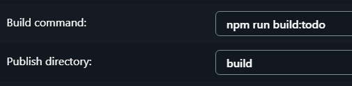<br>

5. Por último, tendremos que esperar a que se inicie el despliegue.
<p align="center"><em>Web desplegada con Netlify</em></p>

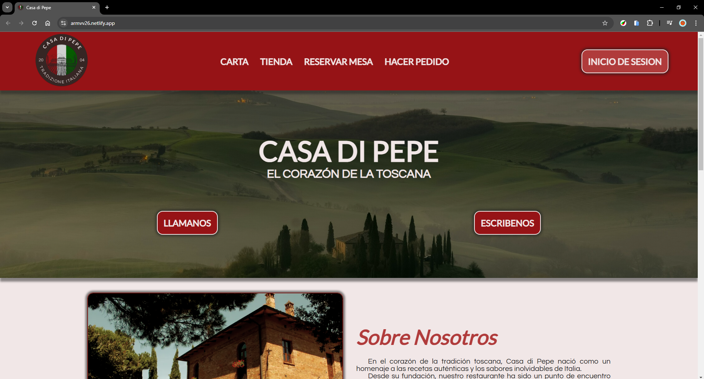<br>

### 2. Herramientas
Las herramientas que voy a usar para analizar la web son:
- [Skynet Technologies](https://freeaccessibilitychecker.skynettechnologies.com/):
  - Herramienta en línea que analiza la web, proporciona un porcentaje de accesibilidad y una lista de errores.
  - Para usarla, simplemente cogemos la dirección de la web desplegada con **Netlify**, la pegamos y esperamos a que el proceso de análisis finalice.

- [Accesibility Checker](https://www.accessibilitychecker.org/):
  - Herramienta en línea que otorga una puntuación de accesibilidad y muestra los problemas de la web.
  - Para usarla es igual que la anterior.

- [Unlighthouse](https://next.unlighthouse.dev/):
  - Es una herramienta local que combina **Lightohuse** con una interfaz de auditoría para múltiples páginas de una web. Aparte de la accesibilidad, genera un informe sobre: el rendimiento, las buenas prácticas y el SEO.
  - Para usarla es necesario seguir los siguientes pasos:
    1. Instalar el paquete con **Node**.
    2. Una vez instalado, ejecutar la web en modo producción (en el punto [4.3.4](#434-ejecución-del-entorno-de-producción) explico cómo hacerlo).
    3. Y cuando la web sea funcional en local, usamos el siguiente comando, se nos abre un enlace en la web y esperamos a que el proceso de análisis finalice. 
```bash
npm install --save-dev unlighthouse
npx unlighthouse --site http://localhost:XXXX/
```

### 3. Resultados Iniciales
Para comprobar la accesibilidad de mi web, sigo el proceso comentado anteriormente para que las 3 herramientas me analicen la web y me muestren los resultados.

#### 3.1. Resultados
<p align="center"><em>Resultado Skynet Technologies</em></p>

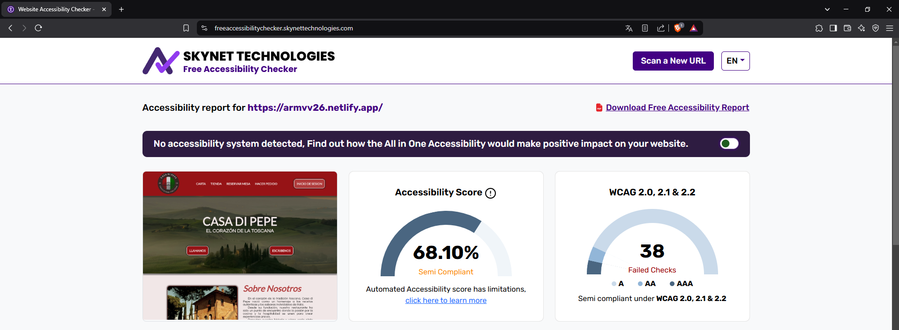<br><br>

<p align="center"><em>Resultado Accesibility Checker</em></p>

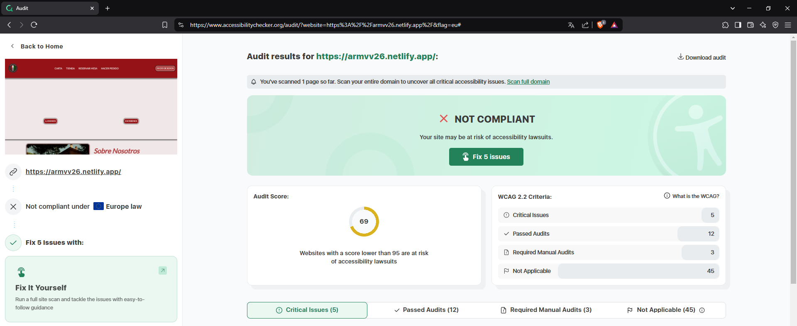<br><br>

<p align="center"><em>Resultado Unlighthouse</em></p>

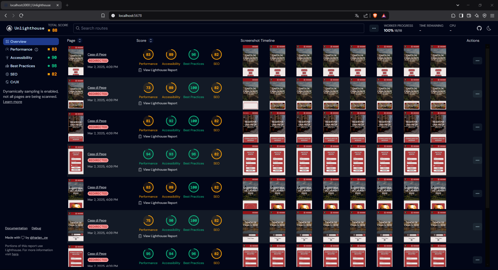

Las herramientas **Skynet** y  **Accesibility Checker** muestran las puntuaciones más bajas (68.10% y 69%, respectivamente), mientras que **Unlighthouse** sitúa la accesibilidad entre un 89% y 96%, en función de la página. Esto es normal debido a que cada herramienta realiza sus propias comprobaciones y aplica reglas distintas.

#### 3.2. Errores Encontrados
Estas herramientas también muestran los errores que tiene la web y cómo solucionarlos. Los errores que me muestra son:

<p align="center"><em>Errores Skynet Technologies</em></p>

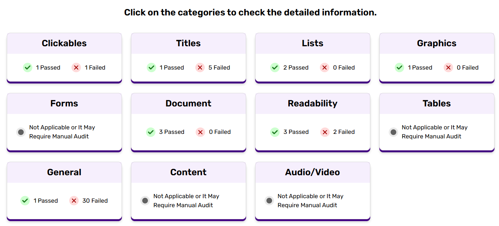<br><br>

<p align="center"><em>Errores Accesibility Checker</em></p>

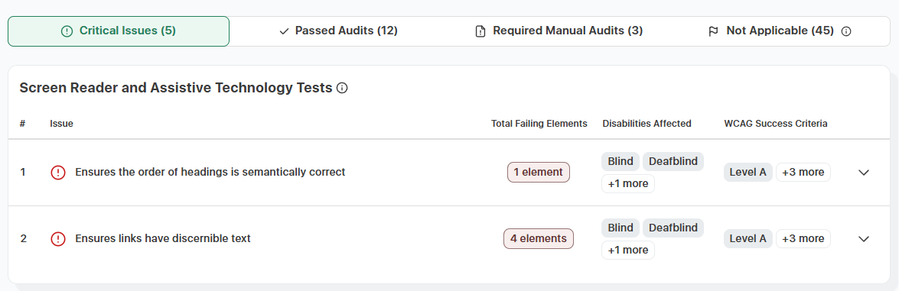<br><br>

<p align="center"><em>Errores Unlighthouse</em></p>

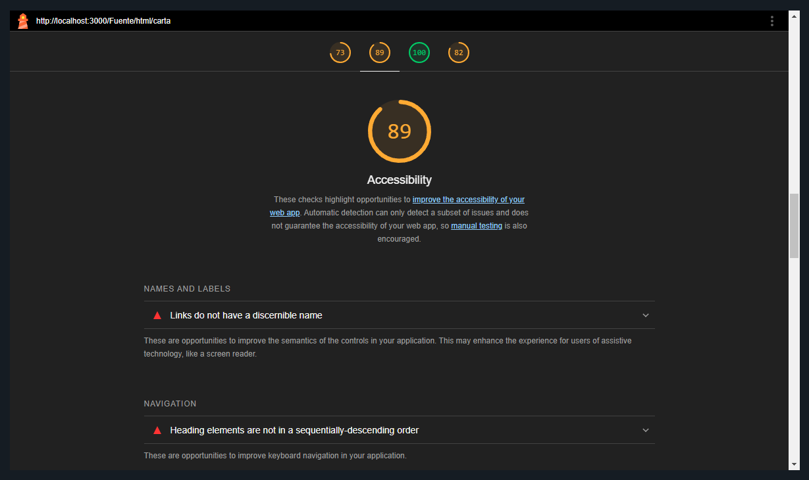

Cada web muestra fallos o errores en función del criterio o reglas que usen para analizar la web. Pero sí que muestran una serie de errores en común que voy a solucionar de la forma que me indican.
- ***Errores Comunes***:
  - **Error de Jerarquía de Encabezados**: En varias páginas se utiliza un *\<h1\>* seguido directamente de un *\<h3\>*, saltándose el nivel *\<h2\>*. Esto puede dificultar la correcta interpretación de la estructura del contenido por parte de los lectores de pantalla y otras tecnologías asistivas.
  - **Links de las Redes Sociales del Footer sin un Nombre Discernible**: Los enlaces de las redes sociales del pie de página carecen de un nombre o descripción adecuada. Esto puede generar confusión en usuarios que dependen de tecnologías de asistencia para navegar el sitio.

- ***Errores No Comunes***:
  - ***Skynet Technologies***:
    - **Enlace sin "href"**: En el pie de página hay un enlace sin el atributo *href*, lo que impide que sean interpretados correctamente como enlaces interactivos.
    - **IDs Duplicados**: Hay varios elementos que comparten el mismo ID. Esto puede generar conflictos en la identificación y manipulación de elementos, afectando a la accesibilidad y la usabilidad.

> [!NOTE]
> Algunos puntos no se detectan de manera automática por el analisis de estas herramientas y requieren una auditoría manual para confirmar o refinar la solución.

### 4. Análisis de Fallos y Solución
Para solucionar los fallos voy a ir 1 a 1, indicando la línea de código donde está el error y la solución que me da la página o que yo he implementado.
- **Enlace de Jerarquía de Encabezados**: Este error está en algunas páginas que tienen una sección principal que son: `index.html`, `pasta.html`, `carta.html` y `formulario-reserva.html`. Por ejemplo, el código de la sección principal `index.html` es:
```html
<!-- Sección Principal con Hero-Image, titulo, subtítulo y botones -->
<section class="introduccion">
  <figure class="img-header-pred img-index"></figure>
  <article class="intro-texto">
    <h1>CASA DI PEPE</h1>
    <h3>EL CORAZÓN DE LA TOSCANA</h3>
  </article>  
  <nav class="intro-botones">
    <a href="tel:123123123" class="boton-pred">LLamanos</a>
    <a href="mailto:casadipepe@gmail.com" class="boton-pred">Escribenos</a>
  </nav>
</section>
```
Para solucionarlo, he modificado la etiqueta *\<h3\>* por una etiqueta *\<h2\>*. Quedaría de la siguiente manera:
```html
<!-- Sección Principal con Hero-Image, titulo, subtítulo y botones -->
<section class="introduccion">
  <figure class="img-header-pred img-index"></figure>
  <article class="intro-texto">
    <h1>CASA DI PEPE</h1>
    <h2>EL CORAZÓN DE LA TOSCANA</h2>
  </article>  
  <nav class="intro-botones">
    <a href="tel:123123123" class="boton-pred">LLamanos</a>
    <a href="mailto:casadipepe@gmail.com" class="boton-pred">Escribenos</a>
  </nav>
</section>
```

- **Links de las Redes Sociales del Footer sin un Nombre Discernible**: Este error está en todas las páginas, ya que todas las páginas tienen el pie de página. El código actual es:
```html
<!-- Sección de la Redes Sociales -->
<nav class="img-redes">
  <a href="https://www.tiktok.com/es/" target="_blank" >
    <i class="fab fa-tiktok"></i>
  </a>

  <a href="https://www.instagram.com/" target="_blank" >
    <i class="fab fa-instagram"></i>
  </a>

  <a href="https://www.youtube.com/" target="_blank" >
    <i class="fab fa-youtube"></i>
  </a>

  <a href="https://www.facebook.com/" target="_blank" >
    <i class="fab fa-facebook"></i>
  </a>
</nav>
```
Para solucionar, he usado el atributo *aria-label* y *aria-hidden*, que sirven para ayudar a las tecnologías de asistencia. Es usado para cuando no es práctico o deseable añadir una etiqueta *\<label\>*. El código quedaría de la siguiente manera:
```html
<nav class="img-redes">
  <a href="https://www.tiktok.com/es/" target="_blank" aria-label="TikTok">
    <i class="fab fa-tiktok" aria-hidden="true"></i>
  </a>

  <a href="https://www.instagram.com/" target="_blank" aria-label="Instagram">
    <i class="fab fa-instagram" aria-hidden="true"></i>
  </a>

  <a href="https://www.youtube.com/" target="_blank" aria-label="YouTube">
    <i class="fab fa-youtube" aria-hidden="true"></i>
  </a>

  <a href="https://www.facebook.com/" target="_blank" aria-label="Facebook">
    <i class="fab fa-facebook" aria-hidden="true"></i>
  </a>
</nav>
```

- **Enlace sin "href"**: Este error también está en todas las páginas, ya que este enlace se encuentra en el pie de página. Su código es:
```html
<a class="boton-footer">¡Síguenos en redes sociales!</a>
```
Para solucionarlo simplemente he añadido un valor temporal al atributo *href*. Quedaría de la siguiente manera:
```html
<a class="boton-footer" href="#">¡Síguenos en redes sociales!</a>
```

- **IDs Duplicados**: Este error ocurre en todas las páginas, ya que para poder implementar las imágenes adaptables he usado **JavaScript** y para obtener los elementos he usado el atributo *id* en todas las imágenes. Un ejemplo de código es:
```html
<figure id="contenedor-img" data-info='["logo-Header", "logotipo", "0"]'>
  <picture>
    <source id="sourcePng" type="image/png">
    <source id="sourceSvg" type="image/svg+xml">
    
  </picture>
</figure>
```
Para solucionar este error, lo que he hecho es modificar el atributo *id* por el atributo *class*. También para que el script de **JavaScript** funcione he tenido que modificarlo para que no busque por *id*, y busque por *class*. Quedaría de la siguiente manera:
```html
<figure class="contenedor-img" data-info='["logo-Header", "logotipo", "0"]'>
  <picture>
    <source class="sourcePng" type="image/png">
    <source class="sourceSvg" type="image/svg+xml">
    
  </picture>
</figure>
```

### 5. Comprobación de las Soluciones
Tras aplicar las soluciones de los problemas o errores que me indicaban las herramientas, voy a ejecutar de nuevo las pruebas de accesibilidad.

#### 5.1. Resultados + Soluciones Errores
<p align="center"><em>Corrección Errores - Skynet Technologies</em></p>

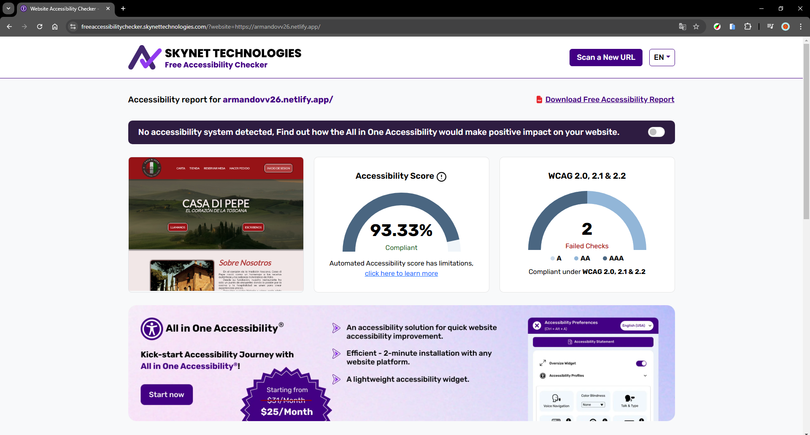<br><br>

<p align="center"><em>Corrección Errores - Accesibility Checker</em></p>

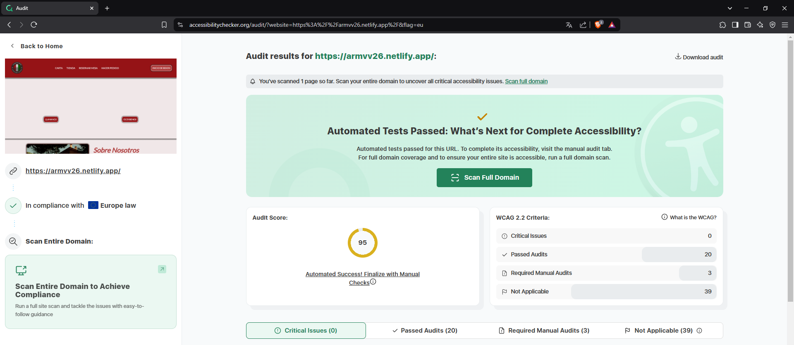<br><br>

<p align="center"><em>Corrección Errores - Unlighthouse</em></p>

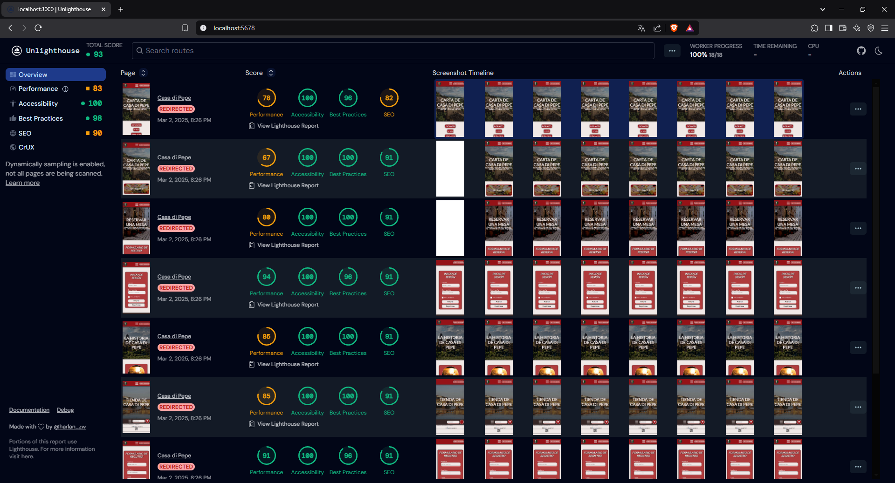<br><br>

La puntuación de la accesibilidad de mi página ha aumentado considerablemente:
- En ***Skynet Technologies***, la puntuación era de 68.10%. Ahora, con todos los cambios, la puntuación a pasado ha ser de 93.33%.
- En ***Accesibility Checker***, la puntuación era 69. Ahora, con todos los cambios, la puntuación ha pasado a ser 95.
- Y en ***Unlighthouse***, la puntuación estaba entre un 89% y un 96%. Ahora es de 100% en todas las páginas.

---

## Pruebas de Usabilidad
Este apartado tiene como objetivo evaluar cómo interactúan los usuarios con la página web. Para ello, voy a definir los usuarios objetivo, las pruebas que van a realizar y los resultados que se han obtenido.

### 1. Descripción de los Usuarios
He seleccionado 5 usuarios que representan a los clientes potenciales de la web:
- **Carlos, 35 años – Diseñador Web**: Gracias a su experiencia es un posible cliente interesado en obtener información en accesibilidad para mejorar en su empresa.
- **Laura, 28 años – Usuaria estándar**: Representa al usuario promedio sin conocimientos técnicos avanzados, evaluando la facilidad de navegación y la claridad de la información.
- **Miguel, 42 años – Usuario con discapacidad visual moderada**: Utiliza lectores de pantalla y otras herramientas de asistencia, lo que le permite identificar problemas de accesibilidad y la correcta interpretación del contenido mediante tecnologías de asistencia. 
- **Alessia, 60 años – Usuario con baja experiencia digital**: Representa a personas que utilizan internet para tareas básicas, evaluando si el diseño y la navegación son lo suficientemente intuitivos para usuarios con poca experiencia.
- **Andrea, 21 años - Estudiante de Diseño y Tecnología**: Gracias a sus conocimientos nos ayudará a evaluar la web desde un punto de vista técnico y de usabilidad.

### 2. Pruebas 
A cada usuario se le ha pedido realizar una serie de pruebas para abarcar todas las funcionalidades de la web. Las pruebas son:
- ***Navegar por la Página Principal***:
  - *Objetivo*: Comprobar que el propósito de la web sea evidente desde el primer contacto.
  - *Tarea*: navegar por la página principal e identificar de qué trata la web.
- ***Buscar Información Específica***:
  - *Objetivo*: Evaluar la efectividad del menú y la estructura de navegación.
  - *Tarea*: Encontrar información sobre un servicio o producto concreto sin recibir ayuda directa.
- ***Interactuar con el Formulario de Registro***:
  - *Objetivo*: Verificar que el proceso de registro sea sencillo y sin errores.
  - *Tarea*: Completar y enviar el formulario de registro, observando si se presentan dificultades en la interacción o en la validación de campos.
- ***Evaluar la Versión Movil***:
  - *Objetivo*: Confirmar que el diseño responsivo funcione adecuadamente en dispositivos móviles.
  - *Tarea*: Acceder a la web desde un smartphone y repetir alguna de las tareas anteriores, analizando la claridad y funcionalidad en pantallas pequeñas.
- ***Simular la búsqueda de un Plato de la Carta***:
  - *Objetivo*: Determinar si el sistema de mostrar y organizar los productos de la carta facilita la localización de la información. 
  - *Tarea*: Navegar por el menú de la carta en busca de un producto.

### 3. Resultados de las Pruebas 
Los resultados obtenidos son:
- **Carlos**: Carlos completó satisfactoriamente todas las pruebas. La navegación, el uso del menú y el proceso de registro se realizaron de manera fluida y sin contratiempos. Su experiencia global indica que el sitio es intuitivo para usuarios con conocimientos en el área, ya que logró identificar rápidamente el propósito de la web y acceder a la información deseada.
- **Laura**: Laura finalizó todas las pruebas asignadas, encontrando la mayoría de las secciones claras y accesibles. Aunque en algún momento tuvo una leve duda al ubicar ciertas áreas del menú, en términos generales la experiencia fue positiva y no se presentó ninguna dificultad importante en ninguna de las funcionalidades evaluadas.
- **Miguel**: Miguel a través de su lector de pantalla, pudo completar todas las pruebas de forma satisfactoria. La estructura accesible del sitio facilitó la navegación. Sin embargo, destacó que la secuencia de encabezados podría optimizarse para una lectura más coherente por parte de las tecnologías de asistencia, lo cual se traduciría en una mejora global en la experiencia de usuario.
- **Alessia**: Alessia completó las pruebas, aunque con mayor lentitud y cierta confusión en la orientación inicial. Encontró complicado identificar rápidamente el objetivo del sitio y acceder a la información sin una guía visual clara. Este perfil fue el que experimentó más dificultades, lo que sugiere la necesidad de incluir elementos orientativos o un breve tutorial en la página principal para facilitar la navegación a usuarios menos habituados a entornos digitales.
- **Andrea**: Andrea realizó todas las pruebas con rapidez y precisión, valorando positivamente la coherencia visual y funcional del sitio. Su evaluación general fue muy favorable, aunque señaló pequeños detalles en la organización de algunos contenidos que, de ser ajustados, podrían optimizar aún más la experiencia del usuario.
